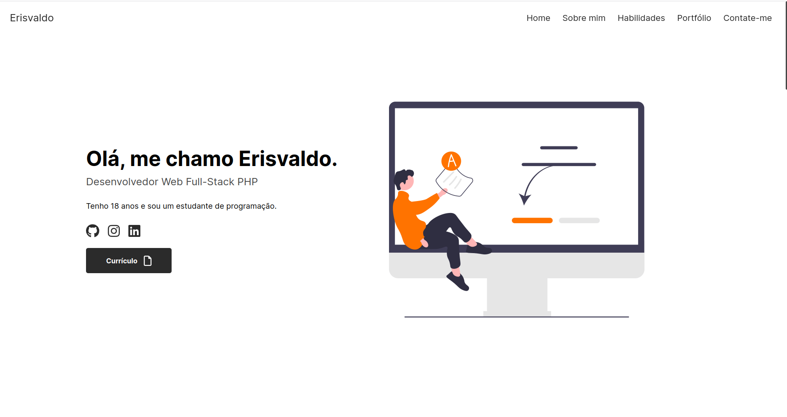

<h1 align="center"> Portfólio Profissional </h1>

    Website para mostrar trabalhos realizados por mim.

  <a href="#tecnologies">Tecnologias</a>&nbsp;&nbsp;&nbsp;|&nbsp;&nbsp;&nbsp;
  <a href="#project">Projeto</a>&nbsp;&nbsp;&nbsp;|&nbsp;&nbsp;&nbsp;
    <a href="#orientações">Orientações</a>&nbsp;&nbsp;&nbsp;|&nbsp;&nbsp;&nbsp;
  <a href="#desafios">Desafios</a>&nbsp;&nbsp;&nbsp;|&nbsp;&nbsp;&nbsp;
  <a href="#extres">Extras</a>&nbsp;&nbsp;&nbsp;|&nbsp;&nbsp;&nbsp;
  <a href="#memo-licença">Licença</a>

  

 

  

## 🚀 Tecnologias

 Esse projeto foi desenvolvido com as seguintes tecnologias: 

- HTML, SASS e Javascript;
- [Vite](https://vitejs.dev/);
- Biblioteca de envio de e-mail chamada [FormSubmit](https://formsubmit.co/).

## 💻 Projeto

 Meu portfólio foi desenvolvido com o objetivo de ser a porta de entrada para aqueles que não conhecem o meu trabalho. 

## 🗺️ Orientações

 Certifique-se de ter o NPM instalado.

<ul style="margin-left: 20px" id="orientations">
  <li> Instale as depedências; </li> 
  <li> Rode em seu terminal o comando 'npm run dev'. </li>
</ul>

 Importante:  O arquivo .env.example é responsável por receber os e-mails. Preencha-o com o e-mail que deseja receber.

## ⚔️ Desafios enfrentados

 Mais uma vez a minha principal dificuldade esteve quanto ao CSS, me inspirei em um portfólio e coloquei a 'mão na massa'. 

## ➕ Extras

 
  Fique a vontade para se inspirar.

## :memo: Licença

Esse projeto está sob a licença MIT.

## Créditos:

<a href="https://www.flaticon.com/br/icones-gratis/carteira" title="carteira ícones">
    Carteira ícones criados por Flat Icons - Flaticon
</a>